# PyMasters

## Práctica y entretenimiento creando, resolviendo y comparando ejercicios lógicos de programación en Python.


---

## Introducción
---

### Datos

> Nombre del proyecto: PyMasters

> Alumnos: Antonio Feliu de Cabrera Salas y Abril Frongia

> Curso: FP Desarrollo de aplicaciones WEB

> Fecha de entrega: 31/5/2023 

## Detalle del proyecto
---
PyMasters nace de un gran interés hacia la resolución de problemas lógicos de programación.
Su objetivo es dar una herramienta fácil y útil para que tanto programadores novatos como veteranos
puedan mejorar, poner a prueba sus habilidades y ayudarse mutuamente. Para personas que se estén
iniciando en la progamación puede ser un gran punto de partida en el que aprender las reglas
fundamentales y formas de razonar. Por otro lado, personas de nivel intermedio-alto pueden,
a parte de resolver retos desafiantes, crear sus propios retos para que el resto de la comunidado ellos mismos
traten de resolverlos.

Un usuario podrá acceder a todo el catálogo de retos definido por la comunidad y tratar de
resolver los que más le llamen la atención. Cada usuario tendrá acceso a su propio perfil y al de resto de usuario.
En dicho perfil se podrá contemplar distinta información, como los retos resueltos, puntuación total del usuario etc.

A la hora de resolver un reto el usuario puede ver qué tests está superando y cuáles no para ver que tan bien o mal encaminado va hacia la respuesta correcta.

Una tabla recogerá la puntuación de todos los usuarios ordenados por puntuación para poder ver tu puesto en el ranking!

## Hitos de PyMasters
---
* Tratar de mimetizar webs como Codewars y Leetcode completamente enfocado en el lenguaje de programación Python.
* Crear una herramienta útil para el aprendizaje.
* Poder compartir distintas formas de afrontar un mismo reto para aprender más allá de nuestro planteamiento inicial.

## Hitos personales
---
* Aprender a crear aplicaciones web con Django y su MVT.
* Comprender mejor cómo se gestionan las/os autorizaciones y roles en aplicaciones reales.
* Trabajar en aplicaciones que traten con código proporciando con el usuario y ser capaz de gestionar los inconvenientes
de seguridad que ello conlleva.

## Tecnologías
---
### Django
* Es el framework utilizado para el proyecto. Django es un framework web de Python muy popular
que cada día está más en auge. Todo se gestiona desde el servidor.
Hace uso de la estructura Modelo Vista Plantilla [MTV (Model View Template)]. Esta arquitectura
permite tener muy bien distinguido todo el proceso de manejo de datos y lógica de la presentación,
lo cual permite una gran escalabilidad a largo plazo. Más adelante entraremos más en dellate de cómo
funciona el MTV y lo compararemos con el popular MVC.

### Html
* HTML (HyperText Markup Language) es un lenguaje de marcado utilizado para crear la estructura
y el contenido de páginas web. En nuestro proyecto, HTML se ha utilizado para definir la estructura
y el diseño de las diferentes páginas del sitio web, como la página principal, perfiles de usuario,
desafíos y formularios de registro e inicio de sesión. HTML permite presentar la información de
manera organizada y proporcionar una experiencia visual atractiva para los usuarios.

### CSS
* CSS (Cascading Style Sheets) es un lenguaje de estilo utilizado para controlar la apariencia
y el diseño de las páginas web. En nuestro proyecto, CSS ha sido fundamental para aplicar
estilos visuales a los elementos HTML, como colores, fuentes, tamaños, márgenes y animaciones.
CSS ha permitido crear una interfaz atractiva,coherente y responsiva en todo el sitio web, mejorando la
experiencia de usuario y la presentación de la información.

### JS
* JavaScript (JS) es un lenguaje de programación utilizado en el desarrollo web para crear
interactividad y funcionalidad dinámica en las páginas. En nuestro proyecto, JS ha desempeñado
un papel crucial al implementar la apariencia y comidad de los editores de código para que los
usuarios puedan crear y resolver retos de programación. Si bien no se ha utilizado para la validación
de datos (ya que django se gestiona en el mismo Django) ha resultado muy útil.

### CodeMirror
* CodeMirror es una biblioteca de JavaScript que proporciona un editor de texto enriquecido y
altamente personalizable. En nuestro proyecto, CodeMirror ha desempeñado un papel fundamental
al ofrecer un entorno de edición de código sofisticado con resaltado de sintaxis, plegado de
código, autocompletado y muchas otras características útiles. Ha mejorado la experiencia de
los usuarios al interactuar con el código en nuestras vistas de desafío y permitido una
programación más eficiente y cómoda.


## Arquitectura del Proyecto
---
En el desarrollo de aplicaciones web, hay varios enfoques arquitectónicos comunes utilizados para organizar
y estructurar el código. Dos de los enfoques más populares son el Modelo Template View (MTV) y el Modelo Vista
Controlador (MVC). Ambos modelos tienen como objetivo separar las preocupaciones y mejorar la modularidad del
código. Para crear PyMasters se ha usado Django, que utiliza Modelo Template View (MTV).
A continuación, veremos en qué consiste cada modelo y cómo se comparan entre sí para tener una idea general.

  * ## Modelo Vista Controlador (MVC)
    ---

    El Modelo Vista Controlador (MVC) es un patrón de diseño
    ampliamente utilizado en el desarrollo de software.
    Se basa en la separación de las responsabilidades en tres
    componentes principales:

      - Modelo (Model): El modelo representa los datos y la lógica de negocio de la aplicación.
      Es responsable de gestionar la persistencia de los datos y proporcionar métodos para acceder
      y manipular esos datos.
      - Vista (View): La vista es responsable de la presentación de la interfaz de usuario.
      Muestra los datos del modelo al usuario y captura las interacciones del usuario. La vista no
      realiza ninguna lógica de negocio y se actualiza cuando los datos del modelo cambian.
      - Controlador (Controller): El controlador maneja las interacciones del usuario y actúa como
      intermediario entre la vista y el modelo. Recibe las solicitudes del usuario desde la vista,
      realiza las acciones necesarias en el modelo y actualiza la vista con los nuevos datos.

    El flujo de datos en el patrón MVC es unidireccional, desde el modelo hacia
    la vista. Cuando se produce una interacción del usuario, el controlador actualiza
    el modelo y, a su vez, el modelo notifica a la vista para que se actualice.
    
  * ## Modelo Template View (MTV) 
    ---
    El Modelo Template View (MTV) es un patrón de diseño utilizado específicamente en el framework
    Django para el desarrollo de aplicaciones web. Es una variante del patrón MVC adaptada a las
    necesidades del desarrollo web.

      - Modelo (Model): Al igual que en MVC, el modelo representa los datos y la lógica de
      negocio de la aplicación. Es responsable de la gestión de los datos y se conecta con la
      base de datos.

      - Template (Template): El template es la parte encargada de la presentación en Django.
      Define cómo se renderiza la información y cómo se muestra al usuario final. Utiliza lenguajes de plantillas para generar HTML dinámico y mostrar los datos del modelo.

      - Vista (View): En Django, la vista es responsable de procesar las solicitudes del
      usuario y generar las respuestas correspondientes. Actúa como intermediario entre el modelo
      y el template. La vista realiza la lógica de negocio y utiliza los datos del modelo para
      generar el contexto necesario para el template.

    A diferencia del flujo unidireccional en MVC, en el MTV el flujo de datos es bidireccional
    entre la vista y el template. La vista recibe las solicitudes del usuario, realiza la lógica
    necesaria, consulta y manipula los datos del modelo, y luego pasa esos datos al template
    para que se rendericen y se muestren al usuario.
---

## Modelos (Models) de PyMasters

Los modelos, como ya comentamos previamente, son los responables de obtener los datos de la BDD,
añadirlos y modificarlos. De forma muy breve y resumida, cada modelo será una "tabla" en la base de datos.
En django los modelos se crean defiendo una nueva clase con el nombre del
modelo, que extienda ```models.Model```.

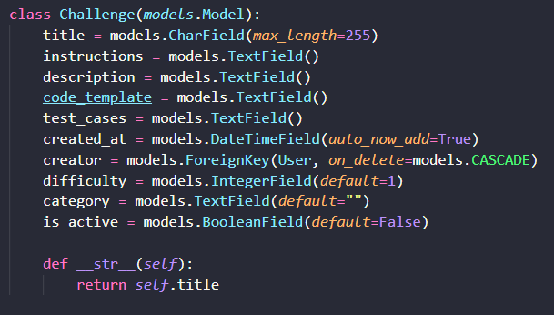

Lo bueno de definir los datos en modelos y no directamente en bdd es que a la hora de
migrar de base de datos no habría que redifinarla
ya que el ORM de Django se encargaría de "traducirlos" lo cual se valora mucho
en temas de escalabilidad,
cambio y largo plazo.

#### Modelo Challenge

| Atributo        | Descripción                                |
|-----------------|--------------------------------------------|
| `title`         | El título del desafío.                     |
| `instructions`  | Las instrucciones del desafío.             |
| `description`   | La descripción del desafío.                |
| `code_template` | El código de plantilla para el desafío.    |
| `test_cases`    | Los casos de prueba para el desafío.       |
| `created_at`    | La fecha y hora de creación del desafío.   |
| `creator`       | El usuario que creó el desafío.            |
| `difficulty`    | La dificultad del desafío.                 |
| `category`      | La categoría del desafío.                  |
| `is_active`     | Indica si el desafío está activo o no.     |

#### Modelo UserChallenge

| Atributo       | Descripción                               |
|----------------|-------------------------------------------|
| `user`         | El usuario que completó el desafío.        |
| `challenge`    | El desafío completado.                    |
| `date_solved`  | La fecha y hora en que se resolvió el desafío. |
| `solution`     | La solución proporcionada por el usuario. |

#### Modelo UserScore

| Atributo    | Descripción                          |
|-------------|--------------------------------------|
| `user`      | El usuario al que se refiere la puntuación. |
| `score`     | La puntuación del usuario.                 |

#### Modelo Comment

| Atributo       | Descripción                            |
|----------------|----------------------------------------|
| `challenge`    | El desafío relacionado con el comentario. |
| `user`         | El usuario que realizó el comentario.  |
| `body`         | El contenido del comentario.           |
| `created_at`   | La fecha y hora de creación del comentario. |

## Vistas (Views) de PyMasters
---
### Vista home
La vista home se encarga de renderizar la página principal del sitio
web. No acepta ningún parámetro y devuelve la plantilla home.html.

### Vista users
La vista users se encarga de mostrar una lista de usuarios y sus
puntajes correspondientes. Obtiene todos los usuarios registrados
y sus respectivos puntajes de la base de datos. Luego los ordena de
mayor a menor puntaje y los pasa a la plantilla users.html para su
visualización.

### Vista user
La vista user muestra el perfil de un usuario específico. Recibe
el parámetro user_id que indica el ID del usuario a mostrar. Busca
el usuario correspondiente en la base de datos y obtiene su puntaje,
el número de retos completados y los retos en los que ha participado.
Luego pasa esta información a la plantilla user_profile.html para su
visualización.

### Vista sign_up
La vista sign_up se encarga de manejar el registro de nuevos
usuarios. Si la solicitud es de tipo GET, muestra el formulario de
registro vacío. Si la solicitud es de tipo POST, procesa los datos
enviados por el usuario. Si los datos son válidos, crea un nuevo
usuario en la base de datos, inicia sesión con el nuevo usuario y
redirige al usuario a la página de retos. Si los datos no son
válidos, vuelve a mostrar el formulario de registro con los mensajes
de error correspondientes.

### Vista not_found
La vista not_found se utiliza para mostrar una página de error 404 cuando se intenta
acceder a una URL no válida. Recibe el parámetro url que indica la URL no encontrada.
Renderiza la plantilla not_found.html para mostrar un mensaje de error al usuario.

### Vista reto
La vista reto muestra un desafío específico y permite al usuario enviar una solución para
ser evaluada. Recibe el parámetro reto_id que indica el ID del desafío a mostrar. Si la
solicitud es de tipo POST, verifica la solución enviada por el usuario, ejecuta los casos de
prueba y muestra el resultado. Si la solicitud es de tipo GET, muestra el desafío y los casos
de prueba correspondientes

### Vista challenge_comments
La vista challenge_comments muestra los comentarios asociados a un desafío específico y
permite a los usuarios agregar nuevos comentarios. Recibe el parámetro reto_id que indica el
ID del desafío. Si la solicitud es de tipo POST, agrega el nuevo comentario a la base de
datos y redirige al usuario nuevamente al desafío para evitar el reenvío del formulario.

### Vista reto_info
La vista reto_info muestra información detallada sobre un desafío específico.
Recibe el parámetro reto_id que indica el ID del desafío. Si la solicitud es de tipo
POST y el usuario tiene los permisos adecuados, se puede aprobar o rechazar el desafío.
En ella, los administradores podrán aprobar o rechazar la solicitud para crear un nuevo reto.

### Vista retos
La vista retos muestra una lista de desafíos disponibles. Si se proporciona un
parámetro de búsqueda, filtra los desafíos por ese término de búsqueda. Renderiza la
plantilla retos.html y pasa la lista de desafíos filtrados al contexto.

### Vista challenges_reviews
La vista challenges_reviews muestra una lista de desafíos pendientes de revisión.
Solo está disponible para usuarios autenticados. Renderiza la plantilla
challenges_reviews.html y pasa la lista de desafíos pendientes al contexto.

### Vista log_out
La vista log_out se encarga de cerrar la sesión del usuario autenticado y redirigirlo a
la página de inicio.

### Vista log_in
La vista log_in muestra el formulario de inicio de sesión. Si la solicitud es de tipo
POST, verifica las credenciales ingresadas por el usuario y, si son válidas, inicia sesión
y redirige al usuario a la página de retos. Si las credenciales no son válidas, muestra
un mensaje de error.

## Plantillas (Templates) de PyMasters
---
### Template home.html
El template home.html es la página principal del sitio web. Muestra información general y enlaces a otras secciones del sitio
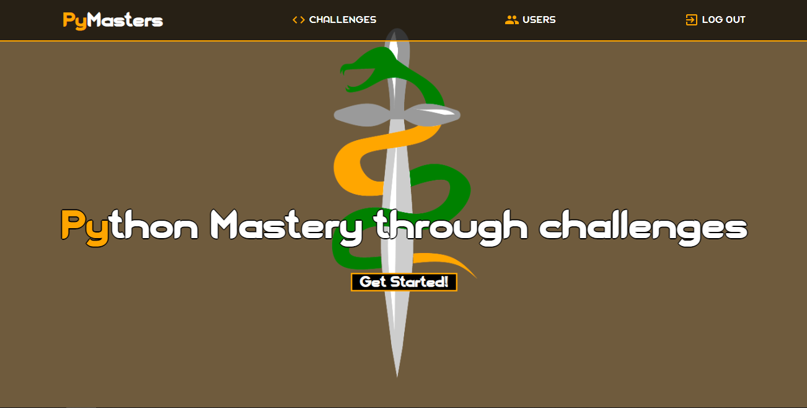
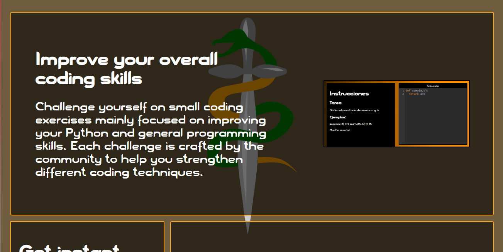
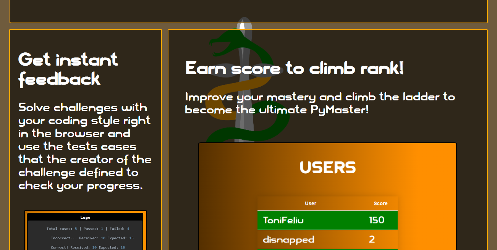
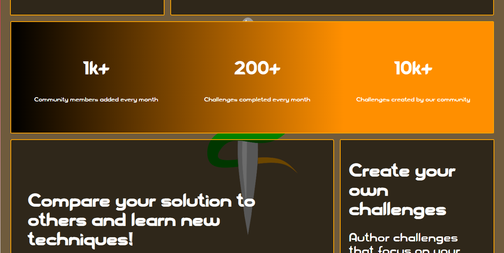
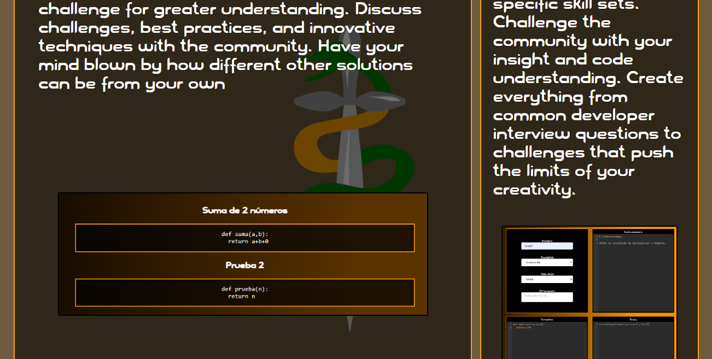

### Template users.html
El template users.html muestra una lista de usuarios y sus puntajes correspondientes.
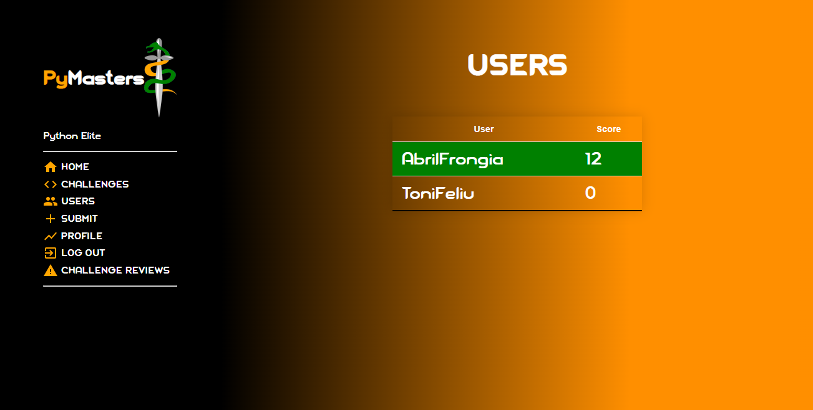

### Template user_profile.html
El template user_profile.html muestra el perfil de un usuario específico. Muestra información como el nombre de usuario, puntaje, número de retos completados y retos en los que ha participado.
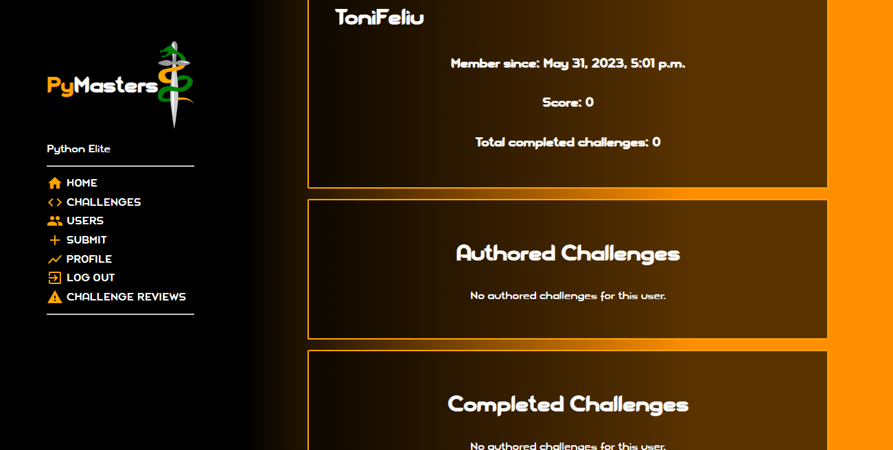

### Template reto.html
El template reto.html muestra un desafío específico y permite al usuario enviar una solución para ser evaluada.
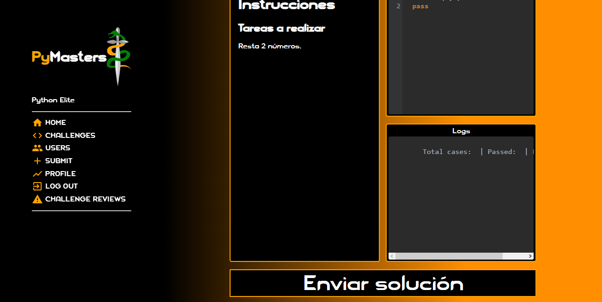

### Template challenge_comments.html
El template challenge_comments.html muestra los comentarios asociados a un desafío específico y permite a los usuarios agregar nuevos comentarios.
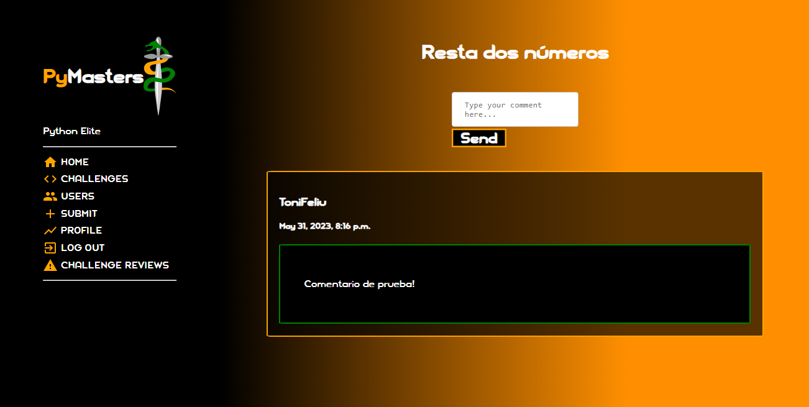

### Template challenges_reviews.html
El template challenges_reviews.html muestra una lista de retos (si existen) cuyo valor
del atributo is_active, sea falso, por lo tanto estén pendientes de confirmar.
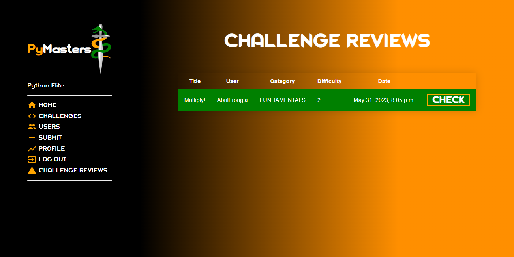

### Template reto_info.html
El template reto_info.html muestra información detallada sobre un desafío específico y permiti a los administradores
aceptar o rechazar retos pendientes.
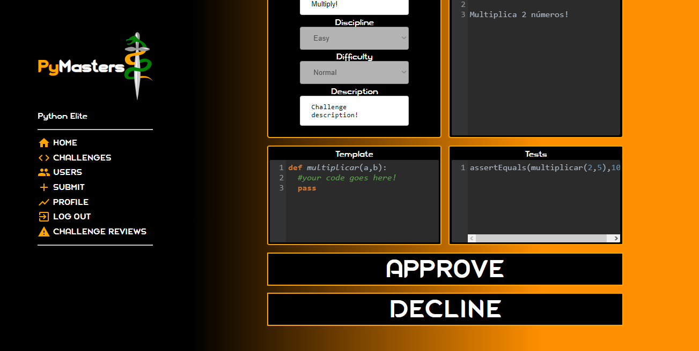

### Template retos.html
El template retos.html muestra una lista de desafíos disponibles filtrables por nombre.
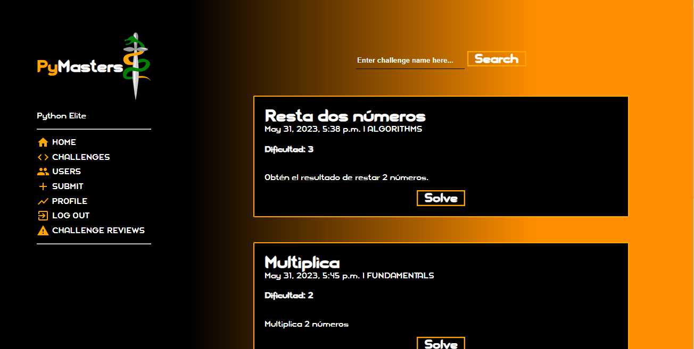

### Template crea_challenge.html
El template crea_challenge.html muestra el formulario para crear un nuevo desafío.
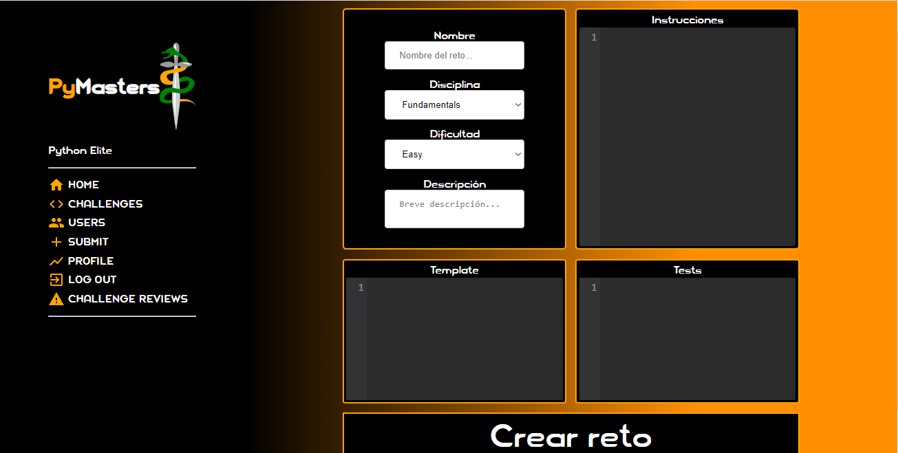
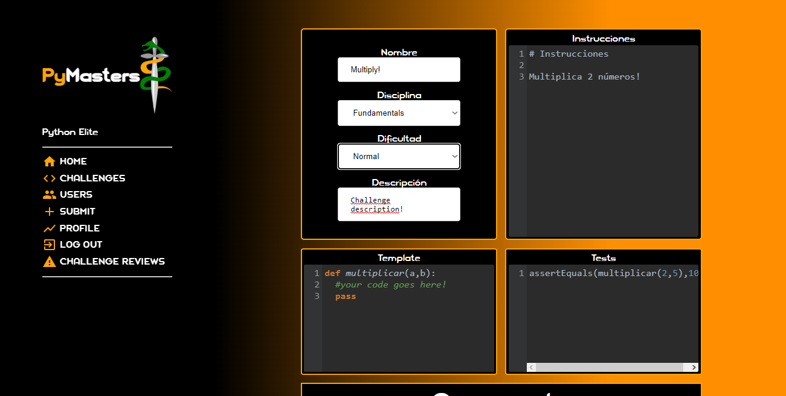